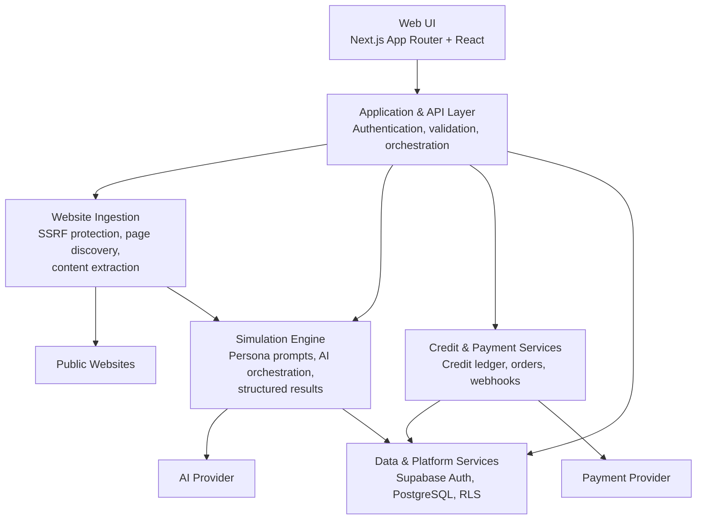
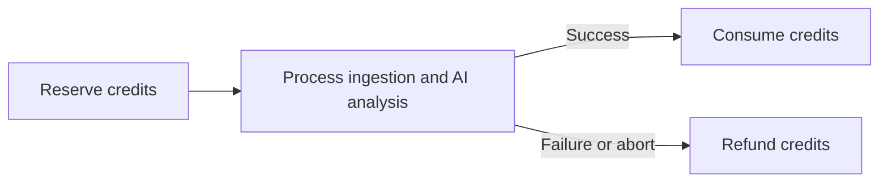
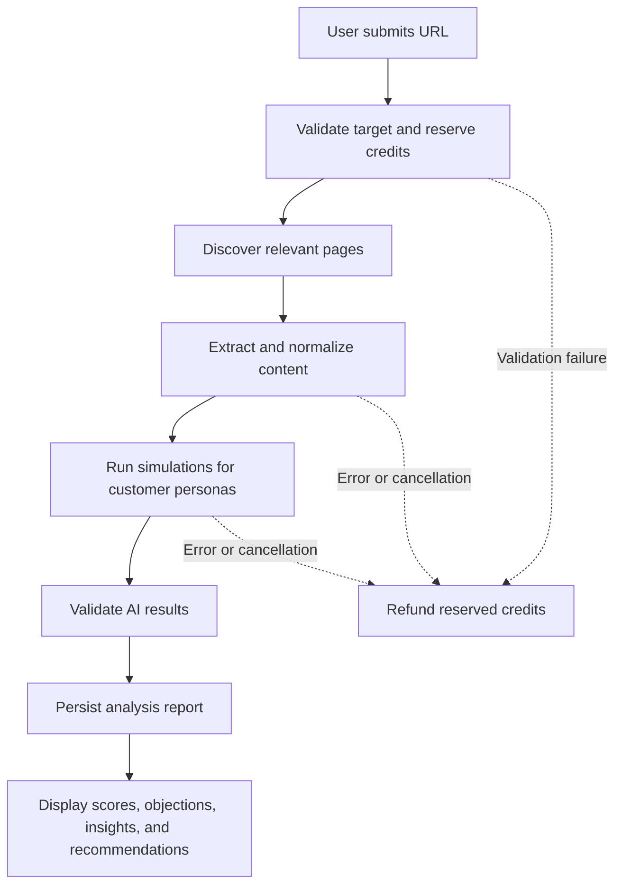

# Shopr

Shopr is a SaaS platform that simulates how different types of potential customers evaluate a website or landing page. It combines website content extraction, AI-powered persona analysis, and structured report storage in one workflow.

## Architecture

## Core Components

### 1. Web UI

The web interface is built with Next.js App Router and React. It provides the landing page, authentication, analysis dashboard, website comparison, report history, persona interviews, and credit management.

### 2. Application & API Layer

The application layer is the entry point for user requests. Its responsibilities include:

- authenticating and authorizing users;
- validating URLs and analysis parameters;
- coordinating the analysis workflow;
- exposing endpoints for reports, payments, promotions, and webhooks; and
- ensuring failed operations do not leave credit transactions in an inconsistent state.

### 3. Website Ingestion

The ingestion module reads publicly available content from the website being analyzed. It validates the target before fetching data, discovers relevant pages, and extracts the content needed by the simulation engine.

Key safeguards include blocking loopback and private-network addresses, request timeouts, response-size limits, and a limit on the number of pages processed per domain.

### 4. Simulation Engine

The simulation engine turns website content into evaluations from multiple customer personas. It manages:

1. selecting websites and personas;
2. sending structured context to the AI provider;
3. validating AI output against an evaluation schema;
4. generating scores, objections, insights, recommendations, and summaries; and
5. supporting both single-website and multi-website comparison analyses.

Results are stored in a structured format so they can be rendered by the UI and used by follow-up diagnostic features.

### 5. Data & Platform Services

Supabase provides authentication and PostgreSQL persistence. Core data includes user profiles, websites, analyses, simulation results, custom personas, and credit transactions.

Row Level Security (RLS) restricts access based on account ownership. Operations that require consistency across multiple records use database procedures or the appropriate server-side service layer.

### 6. Credit & Payment Flow

Analysis usage follows a reserve-consume-refund lifecycle:

Top-ups are processed through an external payment provider. Order status is updated through a validated webhook, after which the purchased credits are added to the user's ledger.

## Analysis Flow

If processing stops because of an error or cancellation, the reserved credits are returned through the refund path. This keeps the user's balance aligned with work that was actually completed.

## Security Principles

- User data is isolated through authentication and Row Level Security.
- External websites are accessed only through the SSRF-protected ingestion path.
- AI, database, and payment secrets are used only on the server.
- Important inputs and outputs are validated before processing or persistence.
- Payment fulfillment relies on validated webhooks rather than client-reported status alone.

## Scope

This document describes the system's architecture and primary flows at a high level. Implementation details, deployment configuration, endpoint structure, and database schema may change without changing the architectural concepts described above.
