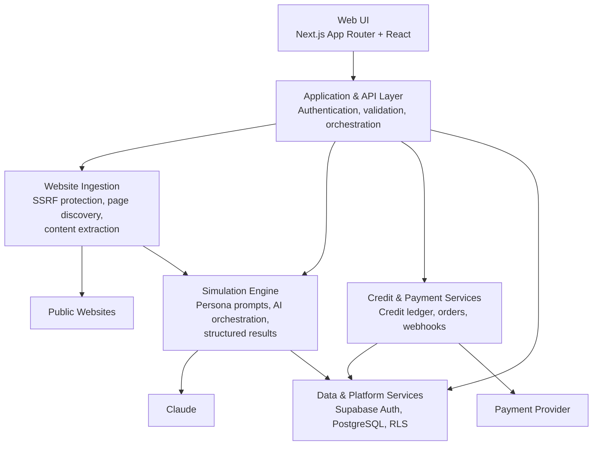
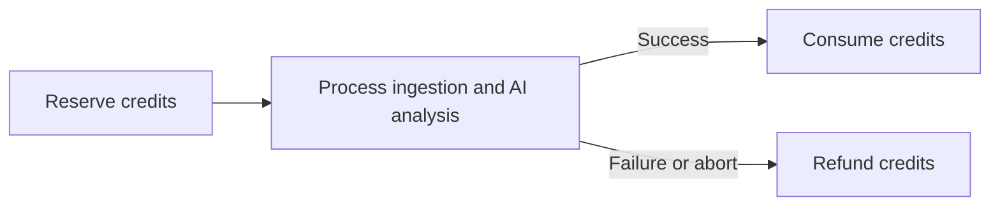
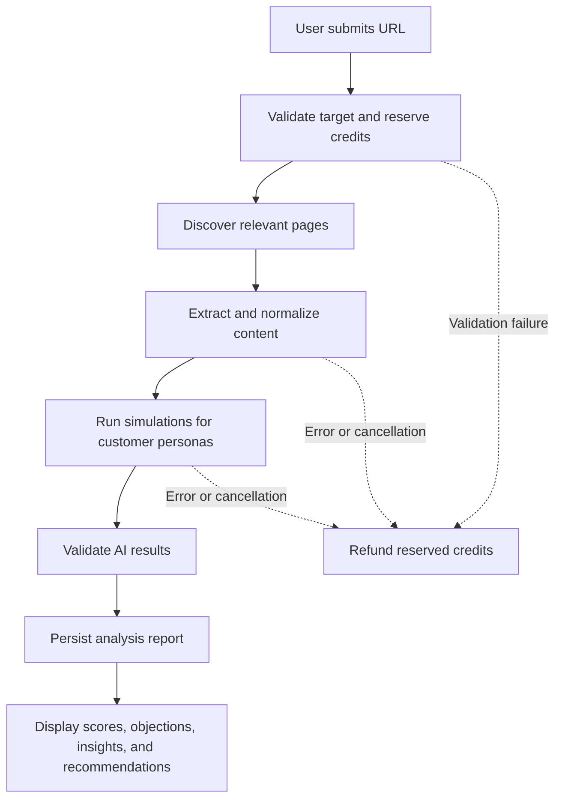

# Shopr

Shopr is a SaaS platform that simulates how different types of potential customers evaluate a website or landing page. It combines website content extraction, AI-powered persona analysis, and structured report storage in one workflow.

## Architecture

Core Components

1. Web UI

Next.js App Router and React. Provides the landing page, authentication, analysis dashboard, website comparison, report history, persona interviews, and credit management.

2. Application & API Layer

Entry point for user requests. Responsibilities:

· authenticate and authorize users;
· validate URLs and analysis parameters;
· coordinate the analysis workflow;
· expose endpoints for reports, payments, promotions, and webhooks;
· ensure failed operations do not leave credit transactions in an inconsistent state.

3. Website Ingestion

Reads publicly available content from the target website. Validates the target before fetching, discovers relevant pages, extracts content for the simulation engine.

Safeguards: blocking loopback and private-network addresses, request timeouts, response-size limits, and a cap on pages processed per domain.

4. Simulation Engine

Turns website content into evaluations from multiple customer personas. Manages:

1. selecting websites and personas;
2. sending structured context to Claude;
3. validating AI output against an evaluation schema;
4. generating scores, objections, insights, recommendations, and summaries;
5. supporting single-website and multi-website comparison analyses.

Results are stored in a structured format for the UI and follow-up diagnostic features.

5. Data & Platform Services

Supabase provides authentication and PostgreSQL persistence. Core data: user profiles, websites, analyses, simulation results, custom personas, credit transactions.

Row Level Security (RLS) restricts access by account ownership. Multi-record consistency uses database procedures or the server-side service layer.

6. Credit & Payment Flow

Analysis usage follows a reserve-consume-refund lifecycle:

Top-ups go through an external payment provider. Order status updates through a validated webhook, then purchased credits are added to the user's ledger.

Analysis Flow

If processing stops due to error or cancellation, reserved credits return through the refund path. Balance stays aligned with completed work.

Security Principles

· User data isolated through authentication and Row Level Security.
· External websites accessed only through the SSRF-protected ingestion path.
· AI, database, and payment secrets used only on the server.
· Inputs and outputs validated before processing or persistence.
· Payment fulfillment relies on validated webhooks, not client-reported status.

Scope

High-level architecture and primary flows. Implementation details, deployment configuration, endpoint structure, and database schema may change without changing the architectural concepts described above.
